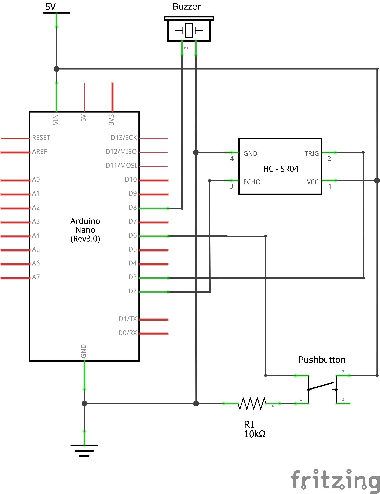
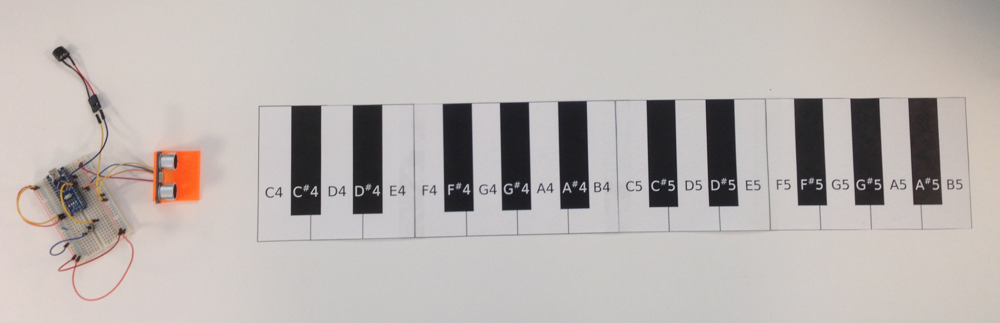

# Ultrasonic Keyboard

Ultrasonic Keyboard is an electronics project that uses an Arduino, an ultrasonic sensor, and a piezobuzzer to create a mock piano keyboard that plays tones using distance readings from the sensor. The idea takes inspiration from the [theremin](https://en.wikipedia.org/wiki/Theremin).

This project is not intended to be used functionally. Instead, it is meant to serve as a basic introduction to working with microcontrollers, circuitry, and digital audio.

## Materials
To assemble this project, you'll need:
- 1x Arduino Nano
- 1x HC-SR04 Ultrasonic Sensor
- 1x Piezo Buzzer
- 1x Pushbutton
- 1x 10kOhm Resistor

## Schematic
Here is a schematic of the circuit:

The pushbutton is used as a mute switch and the resistor is a pulldown with a 10 kOhm value as [suggested by Arduino's pins tutorial](https://www.arduino.cc/en/Tutorial/DigitalPins). The on-board LED will light up if the buzzer is muted.

## Assembly
There are a few pieces to put together for this project.

### Circuit
An example of how this circuit can be put together on a breadboard:

### Keyboard
Print out the [keyboard](keyboard_print.svg) on four pieces of standard letter paper (8.5" x 11") in landscape mode. Cut out the groupings of keys and tape them together to create the "full" [two-octave keyboard](keyboard.svg)

### Workspace
Some things to consider when setting up the work space:
- The entire keyboard is about 70 cm (~27.5 in) long
- There needs to be about 2 cm from the sensor to the start of the keyboard
	- The HC-SR04 has a minimum distance of 2 cm
- The circuit described above assumes the circuit is receiving power over USB
	- Space can be simplified if there is a separate power source

The best orientation is to have the assembled circuit on the left, with the HC-SR04 mounted in a case and facing right. The image belows shows such a configuration.

## Using the Keyboard
The entire configuration requires that the HC-SR04 direction be parallel to the surface that the keyboard rests on. This usually means that the HC-SR04 needs to be propped up, mounted, or in an enclosure. This project also includes a [mount model](hc-sr04_mount.stl) that can be 3D printed and will support the HC-SR04 so that it will suit a usable configuration.

The sensor needs to be at least 2 cm from the start of the keyboard so that the keyboard distances match what the microcontroller code is programmed for. The plastic extension of the 3D mount roughly matches the minimum distance, but you may still need to "calibrate" the position by finding the minimum distance at which the buzzer emits a noise and align your C4.

To play notes, move a solid object (the "reflector") over the desired key in front of the sensor to "obstruct it". A flat object works best, as any bends in the reflector can redirect the ultrasonic waves so that the reader is unable to detect them.

To play a melody, position your reflector over the proper notes, lifting the reflector up (in the Z-axis) to unobstruct the sensor so it plays no sound between notes.

## How It Works
The HC-SR04 module emits an ultrasonic sound wave and detects its reflection, effectively measuring the distance between the sensor and the reflected object. See the [HC-SR04 manual](https://docs.google.com/document/d/1Y-yZnNhMYy7rwhAgyL_pfa39RsB-x2qR4vP8saG73rE/edit#!) for more details about the module's operation.

The piano keyboard was designed such that the individual keys have an acceptable margin of error and still correlate with a particular note. This results in a mapping of distance ranges with musical notes. The mapping of distances to notes is done by estimation. Instead of having a table of notes mapped to distance ranges, the distance read from the sensor is divided by a specially chosen value (through trial and error) and the result is rounded to get the closest note.

The piezo buzzer can emit a sound wave at a designated frequency (you can see the note frequency definitions in [pitches.h](ultrasonickeyboard/pitches.h)), and so, will play a sound based on the distance the sensor reads.

The mute circuitry (pushbutton and resistor) is meant to silence the buzzer for assistance in quick debugging situations, or to stop the buzzer from going off without having to remove the buzzer or power source.