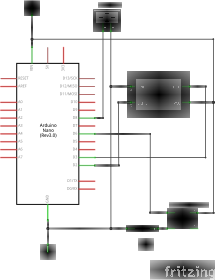
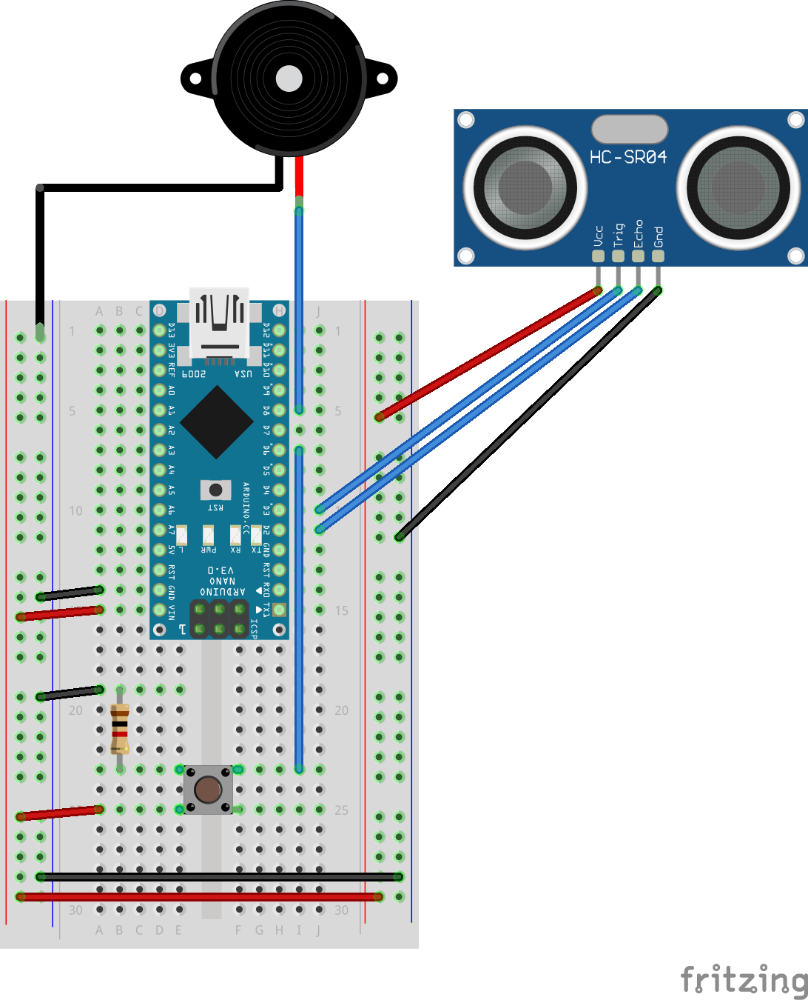

# Ultrasonic Keyboard

Ultrasonic Keyboard is an electronics project that uses an Arduino, an ultrasonic sensor, and a piezobuzzer to create a mock piano keyboard that plays tones using distance readings from the sensor. The idea takes inspiration from the [theremin](https://en.wikipedia.org/wiki/Theremin).

This project is not intended to be used functionally. Instead, it is meant to serve as a basic introduction to working with microcontrollers, circuitry, and digital audio.

## Materials
To assemble this project, you'll need:
- 1x Arduino Nano
- 1x HC-SR04 Ultrasonic Sensor
- 1x Piezo Speaker
- 1x Pushbutton
- 1x 10kOhm Resistor

## Schematic
Here is a schematic of the circuit:

The pushbutton is used as a mute switch and the resistor is a pulldown with a 10 kOhm value as [suggested by Arduino's pins tutorial](https://www.arduino.cc/en/Tutorial/DigitalPins). The on-board LED will light if the buzzer is muted.

## Assembly
There are a few pieces to put together for this project.

### Circuit
An example of how this circuit can be put together on a breadboard:

### Keyboard
Print out the [keyboard ](keyboard_print.svg) on four pieces of standard letter paper (8.5" x 11") in landscape mode. Cut out the groupings of keys and tape them together to create the "full" [two-octave keyboard](keyboard.svg)

### Workspace
Some things to consider when setting up the work space:
- The entire keyboard is about 70 cm (~27.5 in) long
- There needs to be about 2 cm from the sensor to the start of the keyboard
	- The HC-SR04 has a minimum distance of 2 cm
- The circuit described above assumes the circuit is receiving power over USB
	- Space can be simplified if there is a separate power source

The best orientation is to have the assembled circuit on the left, with the HC-SR04 mounted and facing right. The image belows shows such a configuration.

## Using the Keyboard

## How It Works